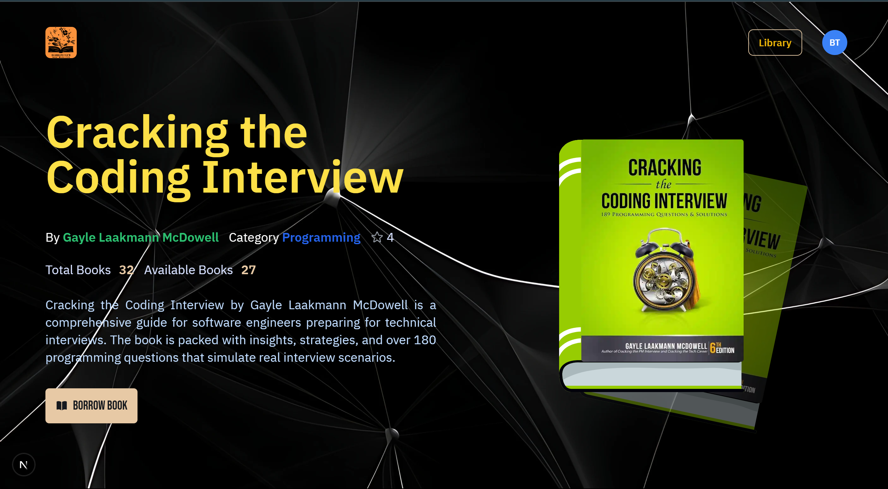
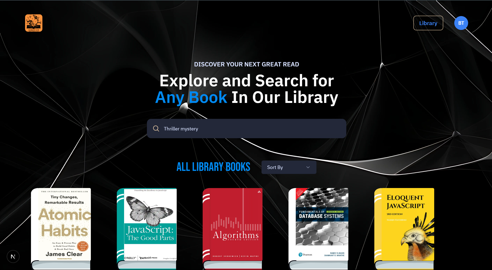

This is a [Next.js](https://nextjs.org) project bootstrapped with [`create-next-app`](https://nextjs.org/docs/app/api-reference/cli/create-next-app).

# University Library Management System

  <br>

 

A comprehensive University Management System designed to streamline library operations, user management, and administrative tasks for educational institutions.

## Features

### User Features
- **Authentication**: Secure sign-in/sign-up with role-based access
- **Library Access**: Browse and search books in the university library
- **Book Details**: View detailed information about each book
- **Profile Management**: Personal profile section for users
- **Borrow System**: Request and manage book borrowings

### 👑 Admin Features
- **Dashboard**: Comprehensive admin dashboard
- **User Management**: Approve/deny account requests, manage existing users
- **Book Management**: Add, edit, and remove books from the library
- **Borrow Records**: Track all book borrowing activities
- **Statistics**: View system usage statistics


## Technologies Used

- **Frontend**: Next.js, React, TypeScript, Tailwind CSS
- **Backend**: Next.js API routes
- **Authentication**: NextAuth.js
- **Database**: Neon PostgreSQL (with Drizzle ORM), Redis
- **File Storage**: ImageKit
- **UI Components**: Shadcn/ui
- **Form Handling**: React Hook Form
- **Validation**: Zod
- **Rate Limiting**: Upstash Redis
- **Email**: Resend

## 📂 Project Structure

```bash
Directory structure:
└── bhupesh227-university-management-system/
    ├── README.md
    ├── auth.ts
    ├── components.json
    ├── drizzle.config.ts
    ├── dummybooks.json
    ├── eslint.config.mjs
    ├── middleware.ts
    ├── next.config.ts
    ├── package.json
    ├── postcss.config.mjs
    ├── tailwind.config.ts
    ├── tsconfig.json
    ├── types.d.ts
    ├── app/
    │   ├── globals.css
    │   ├── layout.tsx
    │   ├── (auth)/
    │   │   ├── layout.tsx
    │   │   ├── sign-in/
    │   │   │   └── page.tsx
    │   │   └── sign-up/
    │   │       └── page.tsx
    │   ├── (root)/
    │   │   ├── layout.tsx
    │   │   ├── page.tsx
    │   │   ├── books/
    │   │   │   └── [id]/
    │   │   │       └── page.tsx
    │   │   ├── library/
    │   │   │   └── page.tsx
    │   │   └── my-profile/
    │   │       └── page.tsx
    │   ├── admin/
    │   │   ├── layout.tsx
    │   │   ├── page.tsx
    │   │   ├── accountRequests/
    │   │   │   └── page.tsx
    │   │   ├── books/
    │   │   │   ├── page.tsx
    │   │   │   ├── [id]/
    │   │   │   │   ├── page.tsx
    │   │   │   │   └── edit/
    │   │   │   │       └── page.tsx
    │   │   │   └── new/
    │   │   │       └── page.tsx
    │   │   ├── borrowRecords/
    │   │   │   └── page.tsx
    │   │   └── users/
    │   │       └── page.tsx
    │   ├── api/
    │   │   ├── auth/
    │   │   │   └── [...nextauth]/
    │   │   │       └── route.ts
    │   │   ├── imagekit/
    │   │   │   └── route.ts
    │   │   └── workflows/
    │   │       ├── borrowbook/
    │   │       │   └── route.ts
    │   │       └── onboarding/
    │   │           └── route.ts
    │   ├── fonts/
    │   │   ├── BebasNeue-Regular.ttf
    │   │   ├── IBMPlexSans-Bold.ttf
    │   │   ├── IBMPlexSans-Medium.ttf
    │   │   ├── IBMPlexSans-Regular.ttf
    │   │   └── IBMPlexSans-SemiBold.ttf
    │   └── too-fast/
    │       └── page.tsx
    ├── components/
    │   ├── AuthForm.tsx
    │   ├── Avatar.tsx
    │   ├── BookCard.tsx
    │   ├── BookCover.tsx
    │   ├── BookCoverSvg.tsx
    │   ├── BookList.tsx
    │   ├── BookOverview.tsx
    │   ├── BookReceipt.tsx
    │   ├── BookVideo.tsx
    │   ├── BorrowBook.tsx
    │   ├── FileUpload.tsx
    │   ├── Header.tsx
    │   ├── NotFound.tsx
    │   ├── Pagination.tsx
    │   ├── Search.tsx
    │   ├── Sort.tsx
    │   ├── admin/
    │   │   ├── BookStripe.tsx
    │   │   ├── ColorPicker.tsx
    │   │   ├── ErrorFallBack.tsx
    │   │   ├── Header.tsx
    │   │   ├── Loading.tsx
    │   │   ├── Menu.tsx
    │   │   ├── Search.tsx
    │   │   ├── Sidebar.tsx
    │   │   ├── UserCard.tsx
    │   │   ├── dialog/
    │   │   │   ├── AccountConformation.tsx
    │   │   │   └── ConfirmationDialog.tsx
    │   │   ├── forms/
    │   │   │   └── BookForm.tsx
    │   │   └── home/
    │   │       ├── AccountRequests.tsx
    │   │       ├── BorrowRecords.tsx
    │   │       ├── RecentBooks.tsx
    │   │       └── Statistics.tsx
    │   └── ui/
    │       ├── avatar.tsx
    │       ├── button.tsx
    │       ├── dialog.tsx
    │       ├── dropdown-menu.tsx
    │       ├── form.tsx
    │       ├── input.tsx
    │       ├── label.tsx
    │       ├── select.tsx
    │       ├── table.tsx
    │       ├── textarea.tsx
    │       ├── toast.tsx
    │       └── toaster.tsx
    ├── constants/
    │   └── index.ts
    ├── database/
    │   ├── drizzle.ts
    │   ├── redis.ts
    │   ├── schema.ts
    │   └── seed.ts
    ├── hooks/
    │   └── use-toast.ts
    ├── lib/
    │   ├── config.ts
    │   ├── emailTemplate.ts
    │   ├── emailTemplateBorrow.ts
    │   ├── ratelimit.ts
    │   ├── utils.ts
    │   ├── validations.ts
    │   ├── workflow.ts
    │   ├── actions/
    │   │   ├── auth.ts
    │   │   └── book.ts
    │   └── admin/
    │       └── actions/
    │           ├── book.ts
    │           ├── general.ts
    │           └── user.ts
    ├── migrations/
    │   ├── 0000_smart_millenium_guard.sql
    │   ├── 0001_solid_exiles.sql
    │   ├── 0002_good_mariko_yashida.sql
    │   ├── 0003_misty_sprite.sql
    │   └── meta/
    │       ├── 0000_snapshot.json
    │       ├── 0001_snapshot.json
    │       ├── 0002_snapshot.json
    │       ├── 0003_snapshot.json
    │       └── _journal.json
    ├── public/
    └── styles/
        └── admin.css

```


## Installation

1. **Clone the repository:**
```bash
git clone https://github.com/bhupesh227/University-Management-system.git
```
2. **Change Directory**
```bash
cd University-Management-system
```
3. **Install Dependencies**
```bash
npm i
```

4. **Setup .env.local file**
```bash
NEXT_PUBLIC_IMAGEKIT_URL_ENDPOINT=
NEXT_PUBLIC_IMAGEKIT_PUBLIC_KEY=
IMAGEKIT_PRIVATE_KEY=

NEXT_PUBLIC_API_ENDPOINT=
 
DATABASE_URL=

AUTH_SECRET=

UPSTASH_REDIS_URL=
UPSTASH_REDIS_TOKEN=

QSTASH_URL=
QSTASH_TOKEN=

RESEND_TOKEN=

NEXT_PUBLIC_PROD_API_ENDPOINT=
```

5. Run the project

First, run the development server:

```bash
npm run dev
# or
yarn dev
# or
pnpm dev
# or
bun dev
```

Open [http://localhost:3000](http://localhost:3000) with your browser to see the result.

You can start editing the page by modifying `app/page.tsx`. The page auto-updates as you edit the file.

This project uses [`next/font`](https://nextjs.org/docs/app/building-your-application/optimizing/fonts) to automatically optimize and load [Geist](https://vercel.com/font), a new font family for Vercel.

## Learn More

To learn more about Next.js, take a look at the following resources:

- [Next.js Documentation](https://nextjs.org/docs) - learn about Next.js features and API.
- [Learn Next.js](https://nextjs.org/learn) - an interactive Next.js tutorial.

You can check out [the Next.js GitHub repository](https://github.com/vercel/next.js) - your feedback and contributions are welcome!

## Deploy on Vercel

The easiest way to deploy your Next.js app is to use the [Vercel Platform](https://vercel.com/new?utm_medium=default-template&filter=next.js&utm_source=create-next-app&utm_campaign=create-next-app-readme) from the creators of Next.js.

Check out our [Next.js deployment documentation](https://nextjs.org/docs/app/building-your-application/deploying) for more details.


## Credits

<a href="https://www.youtube.com/@javascriptmastery/videos">Mentor</a>
<br>
<a href="https://www.freepik.com/free-ai-image/3d-rendering-abstract-black-white-background_75958149.htm">Image by freepik</a>

